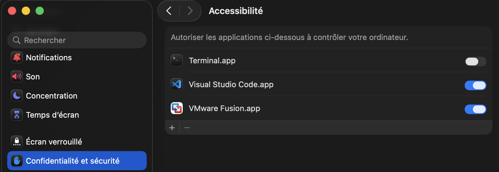

# whipmyai 🎯

> **Whip your AI into shape — one Enter at a time.**  
> Every Enter in VS Code → CRACK 🔊 · Shift/Cmd/Ctrl+Enter → silence.

---

## What is this?

A tiny macOS daemon that plays a whip crack sound every time you press **Enter** in VS Code.  
Three different sounds, picked at random. Zero config after setup.

---

## Requirements

- macOS
- Python 3.9+
- `make`

---

## Setup

> ⚠️ **First — place the project folder where you want it permanently.**  
> The alias will hardcode this path in your `.zshrc`. Don't move it afterwards.

```bash
make install       # creates .venv and installs dependencies
./setup_alias.sh   # adds the 'whip' alias to ~/.zshrc
source ~/.zshrc    # reload your shell
```

### Enable Accessibility permission

`pynput` needs Accessibility access to listen to the keyboard globally.

Go to **System Settings → Confidentialité et sécurité → Accessibilité** and toggle on your terminal app (or VS Code itself):



---

## Usage

```bash
whip   # start the daemon
whip   # stop it  (toggles)
```

Or with make:

| Command           | Effect                          |
|-------------------|---------------------------------|
| `make start`      | Start the daemon in background  |
| `make stop`       | Stop the daemon                 |
| `make status`     | Check if running                |
| `make logs`       | Tail logs in real time          |
| `make uninstall`  | Stop + remove .venv             |

---

## How it works

1. **`pynput`** listens to all keystrokes globally.
2. On `Enter` — checks that **no modifier** is held (Shift, Cmd, Ctrl, Alt). If any is held → silent.
3. Checks that **VS Code is the active app** via macOS `NSWorkspace` API.
4. If both pass → `afplay` plays one of the 3 whip sounds, picked at random.
5. All dependencies live in `.venv/` — nothing is installed globally.

---

## Uninstall

```bash
make uninstall              # stops daemon, removes .venv and tmp files
cd .. && rm -rf whipmyai      # remove the project folder entirely
# then remove the 'whip' function from ~/.zshrc manually
```
